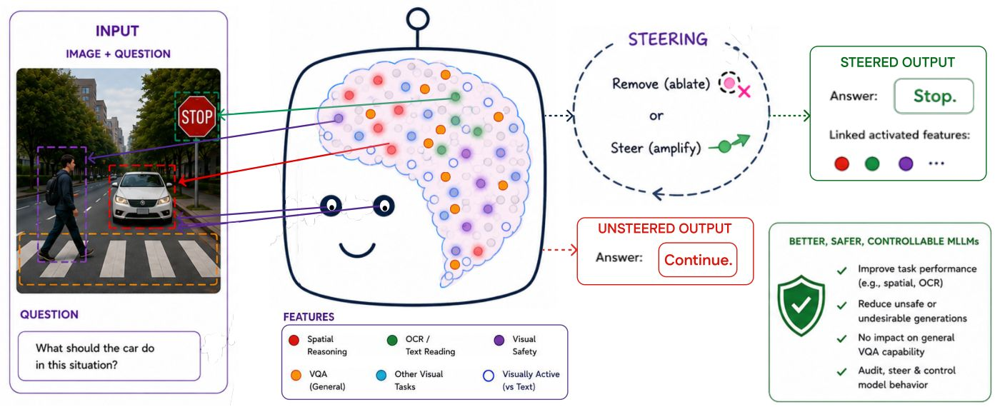
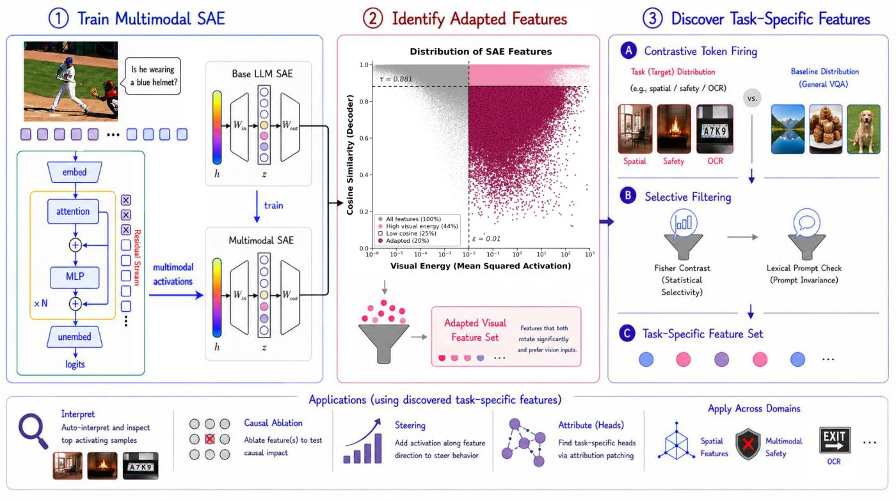

<div align="center">


# Multimodal Model Diffing for Feature Discovery and Control

**Hunar Batra**\*, **Lachin Naghashyar**\*, Ashkan Khakzar, Philip Torr,<br>
Christian Schroeder de Witt, Constantin Venhoff<sup>†</sup>, Ronald Clark<sup>†</sup>

University of Oxford &nbsp;·&nbsp; Microsoft<br>
<sub>\*equal contribution &nbsp;·&nbsp; <sup>†</sup>equal advising</sub>

[](https://huggingface.co/OX-PIXL/MMDiff_SAEs)
[](https://pixl.cs.ox.ac.uk/mmdiff)
[](#release)

</div>

<div align="center">

</div>

---

> **TL;DR** We diff the base-LM SAE against the multimodal SAE to isolate vision-adapted
> features, then use contrastive per-token firing to isolate task-specific features, which we
> causally remove or steer to control MLLM behaviour across spatial reasoning, safety and OCR.

## The problem

Multimodal LLMs read text, localize objects and reason about space, but we cannot identify the
internal features behind any capability. So we cannot explain failures, suppress unsafe
behaviour, or steer a capability without retraining.

A sparse autoencoder trained directly on multimodal activations does not resolve this: it mixes
features inherited from the language backbone with those reshaped by multimodal training.

## Approach

<div align="center">

</div>

1. **Train a multimodal SAE** and diff it against the base-LM SAE, with features aligned by index.
2. **Find vision-adapted features:** rotated decoder direction and visually responsive
   (~5&ndash;20% of the dictionary).
3. **Isolate task-specific features** via contrastive per-token firing against a generic VQA
   baseline, with a lexical-invariance filter.
4. **Control:** causal removal, or MMDiff-CAA steering at the feature-associated layer.

## Results

Projecting out a single discovered feature degrades its target behaviour while general visual
question answering is preserved.

| Domain | Removal | General VQA |
|---|---|---|
| Spatial reasoning (mean over three MLLMs) | &minus;12% VSR | &le;1.5% |
| OCR (PaliGemma 2) | &minus;17% OCRBench | &le;1.6% |
| Multimodal safety (PaliGemma 2) | &minus;24% attack success rate | &le;1% |

Steering the same features improves spatial accuracy by **+3.6%** and OCR by **+1.8%** over a
single-layer CAA baseline.

The pipeline transfers unchanged across three model families:

| Model | Backbone | SAE | Mean &Delta;VSR |
|---|---|---|---|
| MMDiff-Llama | LLaMA-3.1-8B | TopK | &minus;10.1% |
| MMDiff-Gemma | Gemma-2-2B | JumpReLU | &minus;12.3% |
| MMDiff-Qwen | Qwen3-1.7B | TopK | &minus;14.6% |

## Checkpoints

Text-only-masked SAEs for both multimodal backbones are on the Hugging Face Hub at
[**OX-PIXL/MMDiff_SAEs**](https://huggingface.co/OX-PIXL/MMDiff_SAEs).

| Directory | Model | SAE | Layers | Width |
|---|---|---|---|---|
| `llava_more/topk_text_only/` | LLaVA-MORE (LLaMA-3.1-8B) | TopK, k=50 | 32 | 32,768 |
| `paligemma2/jumprelu_text_only/` | PaliGemma 2 (Gemma-2-2B) | JumpReLU | 26 | 16,384 |

```python
import torch
from huggingface_hub import hf_hub_download

path = hf_hub_download(
    "OX-PIXL/MMDiff_SAEs",
    "paligemma2/jumprelu_text_only/text-only_layer_13.pt",
)
sae = torch.load(path, map_location="cpu")
# keys: W_enc, b_enc, W_dec, b_dec, threshold (JumpReLU only)
```

## Release

The training, discovery and intervention code will be released in this repository.
Star or watch to be notified.

## Citation

```bibtex
@inproceedings{batra2026mmdiff,
   title  = {Multimodal Model Diffing for Feature Discovery and Control},
   author = {Batra, Hunar and Naghashyar, Lachin and Khakzar, Ashkan
             and Torr, Philip and Schroeder de Witt, Christian
             and Venhoff, Constantin and Clark, Ronald},
   year   = {2026},
   eprint = {2608.09928},
   archivePrefix = {arXiv},
   primaryClass  = {cs.CV},
   url    = {https://arxiv.org/abs/2608.09928},
}
```
